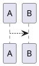
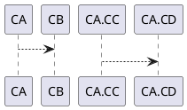
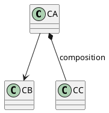
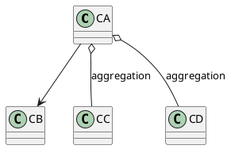
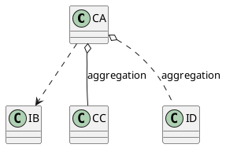
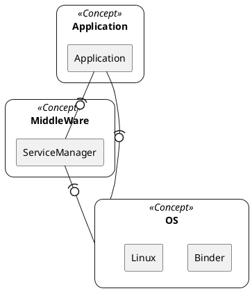

New finding of plantuml : How to show plantuml as a png without server

# New methods how to show plantuml 

## policy and steps
- make plantuml file separately
    - make plantuml file (sample.txt)  in github : [raw file example](https://raw.githubusercontent.com/cheoljoo/cheoljoo.github.io/master/sample.txt)

```text
    @startuml
    Alice -> Bob: Authentication Request
    Bob --> Alice: Authentication Response
    
    Alice -> Bob: Another authentication Request
    Alice <-- Bob: Another authentication Response
    @enduml
```

## plantuml for Editor
- insert lines (puml) to show plantuml in ATOM and visual studio code editor as preview
    - use puml !includeurl with raw file location in md file
```puml
!includeurl https://raw.githubusercontent.com/cheoljoo/cheoljoo.github.io/master/sample.txt
```

## plantuml for web
- change it into png or external link using plantuml proxy

### png : directly create png file using java plantuml.jar
- make png files in specific directory and change the puml into png link

### external link using plantuml proxy  proxy?rawFileLocation
- this is the best method to show it. it can reduce the waste storage because puml will be proessed (emulated)  through plantuml proxy server.
	- 
- this is source of link and input file
    - source of link 

```

```

    - input file 

```
@startuml
Alice -> Bob: Authentication Request
Bob --> Alice: Authentication Response

Alice -> Bob: Another authentication Request
Alice <-- Bob: Another authentication Response
@enduml
```


# Lable on relations of class
- I will describe the basic usages.
    - Class : name starts with C
    - Interface : name starts with I

## Map between C++ and plantuml
- normal class with derived class
```cpp
class A : B {};
```




- inner class
```cpp 
class  CA : CB {
    class CC : CD {
    }
}
```




- class with members (member variables) : composition
```cpp
class CA : CB {
    CC mC;
}
```




- pointer or reference : aggregation
```cpp
class CA : CB {
    CC& mC;
    CD* mD;
}
```



- Interface
```cpp
class CA : IB {
    CC& mC;
    ID* mD;
}
```




## relations between modules
- API calls




## list of used class
```
@startuml
skinparam componentStyle uml2

package "Package_A" {
[First Component]
[Second Component]
}
[Third Component]

@enduml
```


